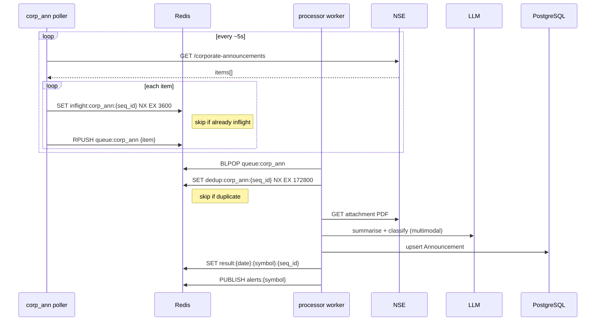
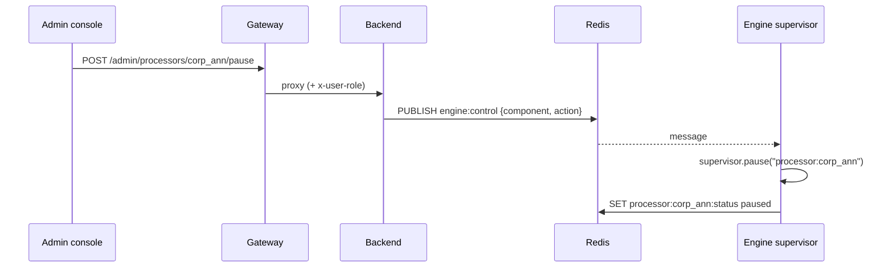

# Data flow & Redis

The engine and the API never call each other directly. They coordinate entirely through Redis: the engine maintains status and health keys and consumes commands; the API reads those keys and publishes commands. This page is the map of that shared state.

## The corporate-announcements pipeline

## Redis key map

All keys are defined in `database/redis.py`.

### Work queue & deduplication

| Key | Type | Set by | TTL | Purpose |
|---|---|---|---|---|
| `queue:{api}` | list | poller (RPUSH) → worker (BLPOP) | — | Per-stream work queue. |
| `inflight:{api}:{item_id}` | string | poller | 1 h | Guard so the same item isn't enqueued twice while in flight. |
| `dedup:{api}:{seq_id}` | string | processor | 48 h | Guard so an item isn't processed twice. |

### Results & delivery

| Key | Type | Set by | TTL | Purpose |
|---|---|---|---|---|
| `result:{YYYYMMDD}:{symbol}:{seq_id}` | string (JSON) | processor | until midnight IST | Daily cache of a processed announcement payload. |
| `alerts:{symbol}` | pub/sub channel | processor (PUBLISH) | — | Live alert stream that delivery adapters subscribe to. |
| `watch:{symbol}` | — | API | — | Watchers of a symbol. |
| `user:{user_id}:channels` | — | API | — | A user's delivery channels. |

### Poller health (written by the engine, read by the API)

| Key | Type | Purpose |
|---|---|---|
| `poller:{api}:heartbeat` | string (epoch) | Liveness beacon; TTL = `3 × interval`. Absence ⇒ stalled. |
| `poller:{api}:last_success` | string (epoch) | Last time the poller fetched data. |
| `poller:{api}:status` | string | `running` · `paused` · `backing_off` · `circuit_open`. |
| `poller:{api}:error_count` | string (int) | Consecutive failures. |
| `poller:{api}:interval` | string (float) | Current poll interval (grows while backing off). |
| `processor:{api}:status` | string | `running` · `paused`. |

### Events & control

| Key | Type | Purpose |
|---|---|---|
| `engine:events` | list (capped at 200) | Rolling event log; newest first. Written with `push_event`, read with `read_events`. |
| `engine:control` | pub/sub channel | Commands from the API to the engine's supervisor. |

## Deduplication and reprocessing

MarkAnn uses **two guards** so items are neither queued twice nor processed twice, while still being retried after a transient failure:

- The **poller** sets `inflight:{api}:{item_id}` (1 h) *before enqueuing*. NSE returns the same announcements on every poll; this stops the same item flooding the queue.
- The **processor** claims `dedup:{api}:{seq_id}` (48 h) *before processing*. This stops two workers analysing the same item.

On a processing **failure**, the processor releases **both** guards so the item is eligible to be re-enqueued and reprocessed on the next poll — with one exception: on `LLMRateLimitError` it releases only `dedup`, because the [ConsumerPool](engine.md#the-consumerpool) re-queues the item itself and the `inflight` guard must stay to prevent a duplicate enqueue.

!!! warning "Why this matters"
    Before this behaviour existed, a failed item released only its `dedup` key. The `inflight` guard lingered for its full 1 h TTL, blocking the poller from re-enqueuing — so an item that failed because (say) the LLM provider was briefly down could sit stranded for up to an hour even after recovery. Releasing both keys on failure means a recovered provider reprocesses the backlog on the very next run. See the [runbook](../operations/runbook.md#stalled-processing-after-a-provider-outage).

## Control command flow

