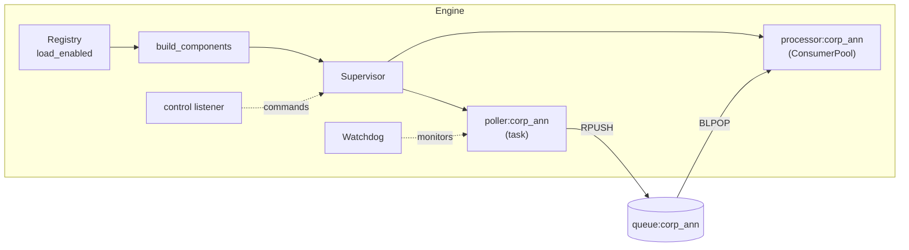

# The engine

The engine (`python -m engine.main`) is the autonomous worker process. It loads enabled components from the [registry](registry.md), supervises them as asyncio tasks, and moves work from NSE through processors to alerts. It has no HTTP surface — it communicates purely through Postgres (its component list) and Redis (queues, status, control).

## Startup

`engine.main.run()` performs these steps:

1. Open Redis, construct the configured [LLM provider](../guides/llm-providers.md), and create a `ProcessPoolExecutor` (used for CPU-bound PDF work).
2. Open an `NseSession` (a cookie-managed `httpx.AsyncClient`).
3. Call `build_components()`, which reads the enabled registry rows via `load_enabled()` and registers each with the `Supervisor` under a namespaced key:
    - pollers as `poller:{api}`
    - processors as `processor:{api}` (each backed by a `ConsumerPool`)
4. Register every poller with the `Watchdog`.
5. `supervisor.start_all()`, then run the watchdog loop and the control listener concurrently until shutdown.



## The Supervisor

`engine/supervisor.py`. A registry of named async factories that it runs as tasks and keeps alive.

| Method | Behaviour |
|---|---|
| `register(name, factory)` | Store a coroutine factory under a name (e.g. `poller:corp_ann`). |
| `start(name)` | Start the task if not already running. On completion, a done-callback restarts it after `restart_delay` (default 2 s) — unless it was cancelled or the supervisor is shutting down. |
| `pause(name)` | Cancel the task and leave it stopped. |
| `restart(name)` | Cancel, await, and start again. |
| `shutdown()` | Set the shutdown flag and cancel everything (no restarts). |

Because restart-on-crash is a `done_callback`, a component that raises is brought back automatically. A component that is **cancelled** (pause) stays down until explicitly resumed — that distinction is how operator pause survives the auto-restart logic.

## The Watchdog

`engine/supervisor.py`. Every `check_interval` (30 s) it inspects each registered poller:

- If the poller's status is `paused`, skip it.
- If the **heartbeat key has expired** (the poller stopped writing it), log a warning, emit a `warn` event, and `restart` the poller.
- If the poller is alive but **`last_success` is older than `silence_threshold`** (default 600 s, `POLLER_SILENCE_THRESHOLD`), log an error for manual review — the poller is running but not producing data (e.g. NSE returning empty or the circuit is flapping).

Heartbeats have a short TTL (`3 × interval`), so a stalled poller's key disappears quickly and the watchdog notices within one check cycle.

## The ConsumerPool

`engine/consumer.py`. Each processor is driven by a pool of `size` worker tasks. A worker loops:

1. `BLPOP queue:{api}` with a 2 s timeout.
2. `json.loads` the item. *(Bad JSON is intentionally left to propagate — it's unrecoverable, so it bubbles up and the supervisor restarts the pool rather than silently dropping items.)*
3. Run the processor function. Two failure modes are handled specially:
    - **`LLMRateLimitError`** → the item is `RPUSH`ed back onto the queue and the worker sleeps for `retry_after` (or 60 s). Nothing is dropped.
    - **Any other exception** → logged and swallowed at the worker level, so one bad item doesn't kill the worker. (The processor itself releases its dedup/inflight guards on the way out — see [Data Flow](data-flow.md#deduplication-and-reprocessing).)

`resize(new_size)` spawns or cancels workers to match the new count; it's how runtime pool resizing takes effect after a restart.

## Live control

`engine.main._listen_control()` subscribes to the Redis `engine:control` pub/sub channel. Messages are JSON:

```json
{ "component": "processor:corp_ann", "action": "pause" }
```

`action` is one of `pause`, `resume` (start), or `restart`. The listener calls the matching `Supervisor` method, updates the component's Redis status key, and emits an event to the log. The backend API publishes these messages in response to console actions — the engine and API never call each other directly.

!!! note "Resize applies on restart"
    Resizing a processor's worker pool writes the new `pool_size` into its registry `config` (via `PATCH /admin/processors/{api}`). The change takes effect the next time the pool is (re)started — which is why the console labels the control **"applies on restart"** and pairs it with **Force-restart**.

## Timing and events

Every processed item is timed by `engine.main._run_processor()`. When a processor's `process()` returns a summary string (indicating real work), the engine writes a single event to the log:

```
processed INFY (Infosys Ltd) — financial_results in 24.09s
```

Skipped items (duplicates, non-PDF attachments) return `None` and produce no event, keeping the log signal-dense. See [Observability](../operations/observability.md).
