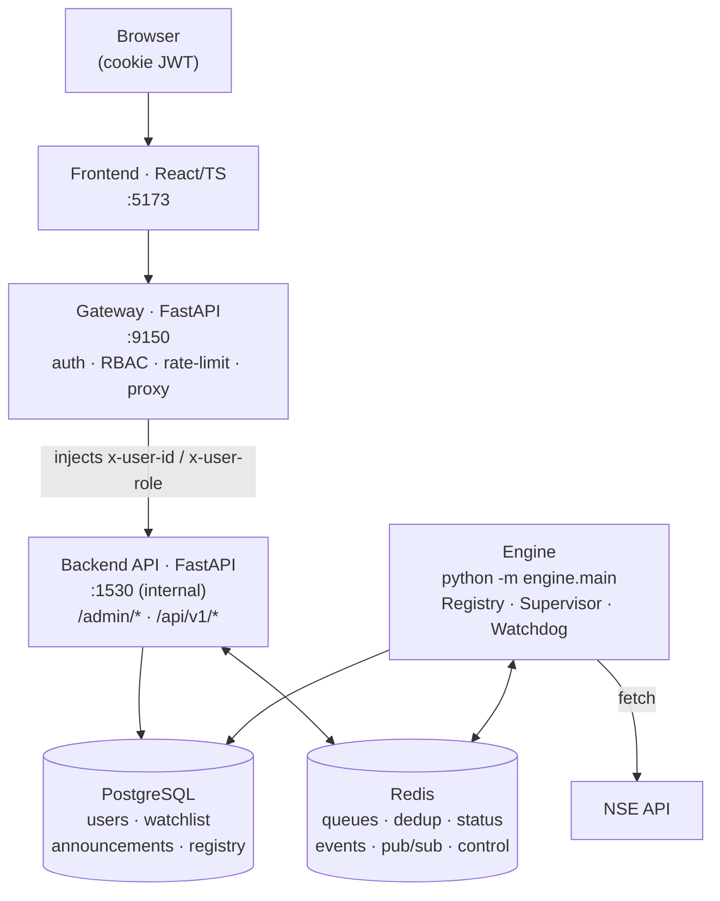

# Architecture overview

MarkAnn is four cooperating services plus PostgreSQL and Redis. Only the **gateway** and the **frontend** are publicly exposed; the backend API and the engine live on the internal network.

## Services and responsibilities

| Service | Directory | Role |
|---|---|---|
| **Gateway** | `gateway/` | The front door and the only public API. Issues/validates JWTs (stored as `httponly`, `samesite=strict` cookies), enforces role-based access by URL prefix, rate-limits, and reverse-proxies allowed requests to the backend with trusted `x-user-*` headers. |
| **Backend API** | `api/` | Source of truth. Serves `/admin/*` (poller & processor health + control, event log) and `/api/v1/*` (watchlist). Trusts the gateway's identity headers. |
| **Engine** | `engine/` | The autonomous worker. Loads enabled components from the registry, runs pollers against NSE, and drains the work queues through processor pools. Hosts the supervisor, watchdog, and circuit breaker. |
| **Frontend** | `app/admin/` | React + TypeScript operations console — the primary human interface for monitoring and controlling the engine. |
| **PostgreSQL** | — | Durable state: users & auth, watchlists, channels, processed announcements, and the component registry. |
| **Redis** | — | The nervous system: work queues, two-level dedup, poller heartbeats/status, the rolling event log, alert pub/sub, and the `engine:control` command channel. |

## Why this shape

**The gateway is the trust boundary.** Everything public terminates at the gateway. It authenticates the caller, decides whether their role may touch the requested path, and only then forwards the request inward — stamping `x-user-id` / `x-user-role` headers the backend trusts. The backend has no auth logic of its own and is never exposed, which keeps authorization in exactly one place. See [Security & Auth](security.md).

**The engine is decoupled from the API.** They never call each other directly — they communicate through Redis. The API writes control commands to a pub/sub channel and reads health/status keys the engine maintains; the engine reads its component list from Postgres and publishes results to Redis. Either can be restarted independently. See [Data Flow & Redis](data-flow.md).

**Components are data, not code.** Which pollers and processors run is a query against Postgres, not a hardcoded list. This is what lets operators enable, disable, reconfigure, and resize components from the console, and lets a new alert type ship as a registered module with no wiring changes. See [Component Registry](registry.md).

## Request lifecycles

=== "A user action (admin console)"

    1. The browser calls the **gateway** with its auth cookie (e.g. `POST /admin/processors/corp_ann/pause`).
    2. The gateway validates the JWT, checks the role against the route prefix (`/admin/*` → `admin`/`superuser`), and proxies to the **backend**.
    3. The backend publishes a command to the Redis `engine:control` channel.
    4. The **engine's** supervisor receives it and pauses the `processor:corp_ann` task.
    5. Health keys update in Redis; the console reflects the new state on its next poll.

=== "An alert (engine pipeline)"

    1. A **poller** fetches from NSE, guards each item with an `inflight` key, and `RPUSH`es it onto `queue:{api}`.
    2. A **processor** worker `BLPOP`s the item, claims a `dedup` key, and does the work (PDF → LLM → Postgres).
    3. It caches the result in Redis and `PUBLISH`es to `alerts:{symbol}`.
    4. Delivery adapters subscribed to that channel forward the alert to users.

## The engine internals

- **`Supervisor`** — registers each component as `poller:{api}` / `processor:{api}`, runs them as supervised asyncio tasks, auto-restarts on crash, and applies pause / resume / restart commands from `engine:control`.
- **`Watchdog`** — reads poller heartbeats from Redis; restarts a poller whose heartbeat has expired and raises a silent-failure alarm when one stops producing data.
- **`CircuitBreaker`** — trips open after repeated NSE failures (CLOSED → OPEN → HALF_OPEN) so a struggling source backs off instead of hammering.
- **`ConsumerPool`** — a configurable number of workers that `BLPOP` a queue and run each item through its processor; resizable at runtime.
- **`NseSession`** — a persistent `httpx.AsyncClient` that manages NSE's required session cookies and refreshes them on 401/403.

Read on: **[The Engine](engine.md)** for the runtime model, or **[Component Registry](registry.md)** for how components are discovered and loaded.
