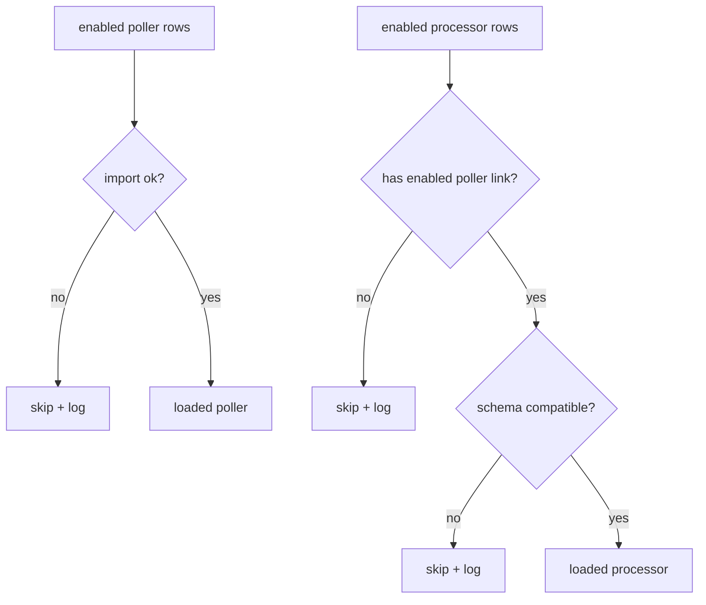

# Component registry

Pollers and processors are **not** wired in code — they are registered rows in PostgreSQL. This is the mechanism that lets operators enable, disable, reconfigure, and resize components from the console, and lets a new alert type ship without touching the engine's startup.

## The tables

| Table | Holds |
|---|---|
| `poller_config` | `module`, `api_name`, `output_schema` (JSON), `config` (JSON), `enabled` |
| `processor_config` | `module`, `api_name`, `input_schema` (JSON), `config` (JSON), `enabled` |
| `processor_poller_link` | many-to-many join: which poller(s) feed which processor |

`api_name` is the stable identifier used everywhere else — in Redis keys (`queue:{api}`, `poller:{api}:status`), in the API paths (`/admin/processors/{api}`), and in the console. By convention it is the last segment of the module path (`engine.pollers.corp_ann` → `corp_ann`).

Both `output_schema` and `input_schema` are stored as JSON Schema, generated from the module's Pydantic models at registration time. Storing them lets the engine validate compatibility without importing the modules.

## What the engine loads at startup

`engine.registry.load_enabled()` is the single source of truth for "what runs". It:

1. reads every **enabled** poller and processor row,
2. resolves each processor to its linked poller `api_name`(s) via the link table,
3. verifies the processor's stored **input schema** is compatible with each linked poller's stored **output schema**, and
4. **skips — with a logged reason — any component that is broken**, so one bad row never takes the engine down.

A processor is skipped (and logged) when:

- it has **no poller link**, or a linked poller id doesn't resolve;
- a **linked poller is not enabled/loaded** (a processor can't run without its source);
- its **module fails to import** or doesn't satisfy the [contract](../reference/component-contract.md);
- its **input schema is incompatible** with a poller's output schema.

A poller is skipped (and logged) when its module fails to import or doesn't satisfy the contract.



## Schema compatibility

`schema_incompatibilities(input_schema, output_schema)` returns a list of human-readable problems (empty means compatible). For every field the processor's input schema declares, it checks that:

- the field **exists** in the poller's output schema, and
- the field's **type matches**.

This catches the most common wiring mistake — linking a processor to a poller that doesn't emit the fields it needs — at registration and at startup, rather than as a `KeyError` deep in processing.

## Registering components — the CLI

`python -m engine.register` manages the registry.

| Command | Purpose |
|---|---|
| `poller <module>` | Register/update a poller module (disabled by default). |
| `processor <module> --poller <api> [--poller <api> …]` | Register/update a processor and its poller link(s). Fails if a linked poller is missing or the schema is incompatible. |
| `enable {poller\|processor} <api_name>` | Enable a component. |
| `disable {poller\|processor} <api_name>` | Disable a component. |
| `list` | Print all registered components, their enabled state, and links. |
| `seed` | Register **and enable** the built-in defaults. |

Registration is **idempotent**: re-registering an existing module refreshes its stored schema and merges new default config keys under any existing stored values, leaving `enabled` untouched.

### Seeding on a fresh deployment

`seed` registers the shipped defaults (currently the `corp_ann` poller + processor) and enables **only newly-created rows**. An operator who later disables a component keeps it disabled across restarts — the seed will re-register it (to refresh schema) but won't re-enable it. In Docker Compose this runs as the one-shot `register` service before the engine starts, so a fresh stack comes up with the corporate-announcements feature already running.

```bash
uv run python -m engine.register seed
```

## Adding your own

The registry is the extension point for every future alert type. Implement the [component contract](../reference/component-contract.md), register the modules, link and enable them — no engine code changes. The full walkthrough is in **[Add an alert type](../guides/add-an-alert-type.md)**.
