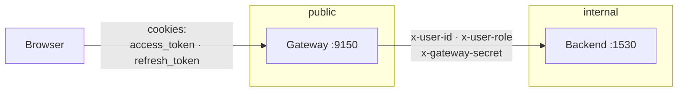
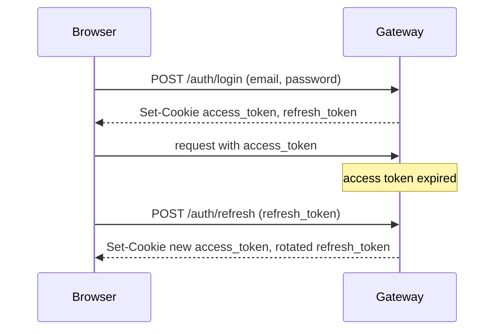

# Security & auth

Authentication and authorization live in **one place**: the gateway. The backend API has no auth logic of its own and is never exposed to the internet — it trusts identity headers the gateway stamps on proxied requests.

## The trust boundary

Everything public terminates at the gateway. It:

1. **authenticates** the caller from the `access_token` cookie,
2. **authorizes** by checking the caller's role against the requested path prefix,
3. **rate-limits**, and
4. **proxies** allowed requests to the backend, stripping the cookies and adding trusted `x-user-*` headers.

Because the backend is only reachable from inside the network and only ever sees pre-authorized requests, authorization is never duplicated or bypassed.

## Tokens & cookies

Defined in `gateway/auth/`.

- **Access token** — a short-lived JWT (`user_id`, `role`, `email`), signed with `JWT_SECRET`.
- **Refresh token** — an opaque random token, stored server-side (`refresh_tokens` table) and rotated on use.

Both are delivered as cookies with hardening flags:

| Flag | Value | Why |
|---|---|---|
| `httponly` | `true` | JavaScript can't read the token (mitigates XSS token theft). |
| `samesite` | `strict` | The cookie isn't sent cross-site (mitigates CSRF). |
| `secure` | set when `HTTPS=true` | HTTPS-only transport in production. |

The flow:

## Role-based access control

Three roles, enforced in the gateway proxy by URL prefix (`gateway/proxy/router.py`):

| Path prefix | Allowed roles |
|---|---|
| `/admin/` | `admin`, `superuser` |
| `/api/v1/` | `trader`, `admin`, `superuser` |
| anything else | 404 (nothing else is proxied) |

A request whose path matches no known prefix is a **404**, not a 403 — the gateway only forwards paths it explicitly recognises. A request to a known prefix by an insufficient role is a **403**.

## Header trust model

When proxying, the gateway:

- **removes** the client's `cookie` and `host` headers, and
- **adds** `x-user-id`, `x-user-role`, and (if configured) `x-gateway-secret`.

The optional `x-gateway-secret` lets the backend verify a request genuinely came from the gateway, so the backend can refuse forged `x-user-*` headers if someone reaches it directly. Set `TRUSTED_GATEWAY_SECRET` on both services to enable it.

!!! danger "Never expose the backend"
    The backend accepts `x-user-*` headers at face value. That is safe **only** because it sits on an internal network behind the gateway. Publishing port `1530` would let anyone forge an identity. In Compose, the backend deliberately has no host port mapping — keep it that way.

## Error semantics

Login failures are intentionally generic. A wrong password and a non-existent email both return **401 "Invalid credentials"** — the API never reveals whether an email is registered (anti-enumeration). The frontend distinguishes a genuine credential failure from an expired-session refresh so it can show the right message rather than a misleading "session expired".

## Rate limiting

`gateway/rate_limit/middleware.py` applies a Redis-backed limit to incoming requests. It is added **inside** CORS so that `429` responses still carry CORS headers and the browser can read them.

## Configuration

| Variable | Purpose |
|---|---|
| `JWT_SECRET` | **Required.** Signs access tokens. Generate with `python -c "import secrets; print(secrets.token_hex(32))"`. |
| `HTTPS` | `true` in production to set the `secure` cookie flag. |
| `ALLOWED_ORIGINS` | CORS allow-list for the frontend origin. |
| `TRUSTED_GATEWAY_SECRET` | Optional shared secret proving requests came from the gateway. |

See the full list in [Configuration](../reference/configuration.md).
