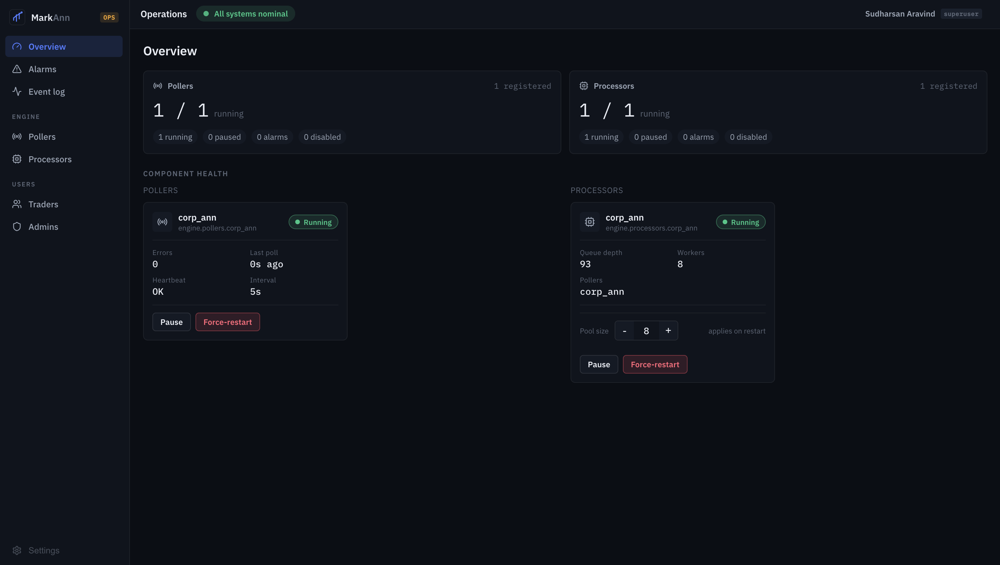
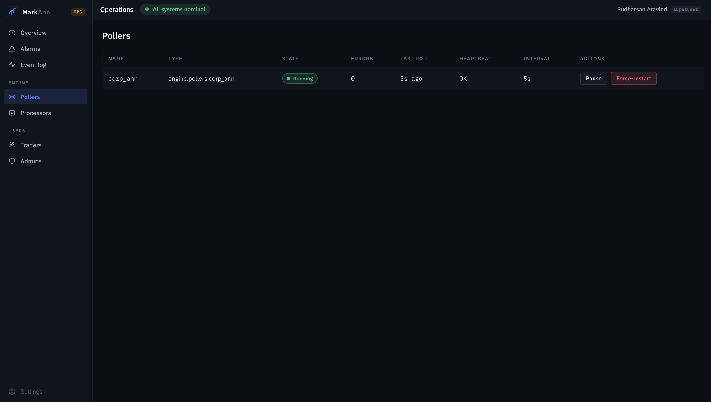
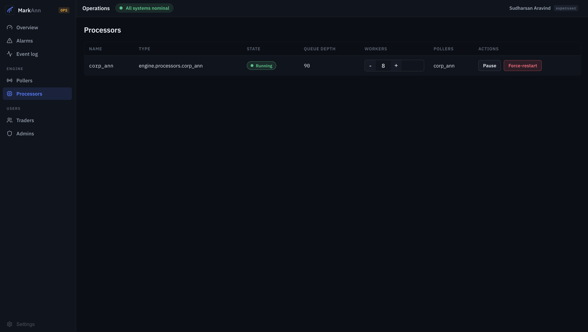
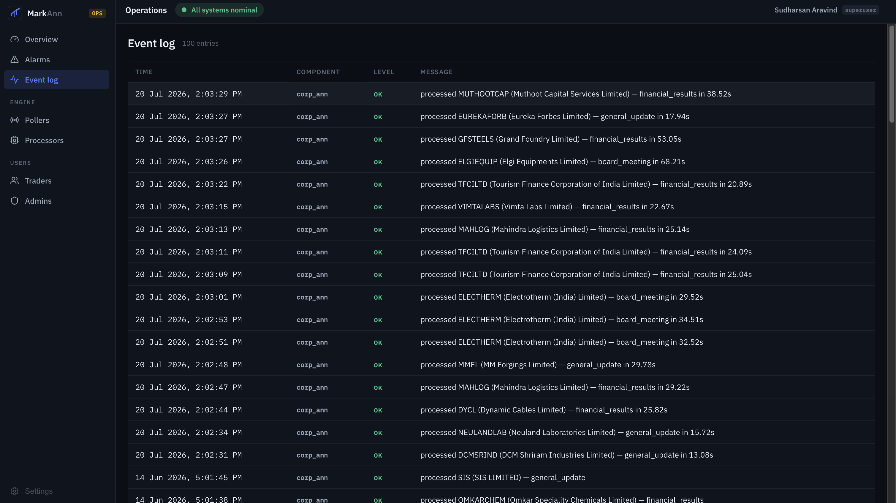

# Admin console

The console (`app/admin/`) is the primary interface for monitoring and controlling the engine. It is a React + TypeScript app served on `:5173`, talking only to the gateway. Everything it shows about pollers and processors is **derived from the registry** — it renders whatever components are registered, with no hardcoded component list.

## Navigation

| Section | Page | Purpose |
|---|---|---|
| — | **Overview** | At-a-glance health for pollers and processors. |
| — | **Alarms** | Active silent-failure and circuit-breaker alarms. |
| — | **Event log** | Rolling engine events with timestamps and processing times. |
| Engine | **Pollers** | Every registered poller, with controls. |
| Engine | **Processors** | Every registered processor, with controls. |
| Users | **Traders / Admins** | User management, scoped by role. |

## Overview

Split **Pollers** and **Processors** KPI cards summarise counts (`running / registered`, plus paused / alarms / disabled), and the **Component health** section shows a live card per component:

- **Poller card** — state, error count, last poll, heartbeat, interval, with **Pause** and **Force-restart**.
- **Processor card** — state, queue depth, worker count, linked pollers, an inline **pool-size stepper**, and **Pause** / **Force-restart**.

## Pollers

A table of every registered poller: **name**, **type** (module path), **state**, **errors**, **last poll**, **heartbeat**, **interval**, and **actions**.

| Action | Effect |
|---|---|
| **Pause** | Stops the poller (`processor:{api}` status → `paused`); the watchdog leaves paused pollers alone. |
| **Resume** | Restarts a paused poller. |
| **Force-restart** | Cancels and restarts the poller task immediately. |

States you'll see: `running`, `paused`, `backing_off` (failing, interval growing), `circuit_open` (circuit breaker tripped).

## Processors

A table of every registered processor: **name**, **type**, **state**, **queue depth** (items waiting in `queue:{api}`), **workers** (the pool-size stepper), linked **pollers**, and **actions**.

| Action | Effect |
|---|---|
| **Resize** (`− n +`) | Writes the new `pool_size` into the processor's registry config. **Applies on restart.** |
| **Pause / Resume** | Stops / restarts the worker pool. |
| **Force-restart** | Restarts the pool — also how a resize takes effect. |

!!! tip "Resize then restart"
    Changing the worker count persists immediately but the running pool keeps its current size until it's restarted — the stepper is labelled **"applies on restart"**. To apply a resize now, adjust the count then **Force-restart** the processor.

## Event log

A table of the most recent engine events (**Time**, **Component**, **Level**, **Message**), newest first, backed by the capped `engine:events` Redis list.

- Timestamps render as `20 Jul 2026, 2:03:29 PM` (datetime with seconds).
- Successful processing shows the per-item duration: `processed INFY (Infosys Ltd) — financial_results in 24.09s`.
- Levels: **OK** (success), **INFO** (operator actions), **WARN** (recoverable issues, fallbacks), **CRIT** (circuit opened).

See [Observability](observability.md) for how to read these and what each level means.

## How control flows

Every action button calls the gateway, which proxies to the backend, which publishes to the Redis `engine:control` channel; the engine's supervisor acts and updates the status key the console reads back. The console never talks to the engine directly. Full sequence in [Data Flow](../architecture/data-flow.md#control-command-flow).

!!! note "New components appear automatically"
    Register a new poller/processor (see [Add an alert type](../guides/add-an-alert-type.md)) and restart the engine — it shows up on these pages with full controls, no frontend change required, because the tables render the registry.
