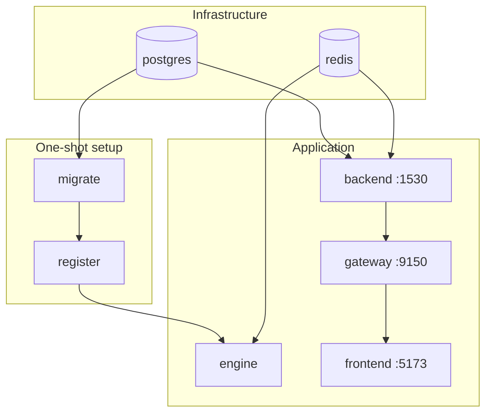

# Deployment

The supported deployment is **Docker Compose**. One command brings up the whole stack — infrastructure, one-shot setup jobs, all three backend services, and the frontend.

## The stack

```bash
git clone https://github.com/vsaravind01/MarkAnn-Bot.git
cd MarkAnn
cp .env.example .env          # fill in JWT_SECRET and your LLM key
docker compose up --build
```

| URL | Service |
|---|---|
| http://localhost:5173 | Admin console (create the first superuser on first run) |
| http://localhost:9150 | Gateway API (the only public API) |

## Service topology

`docker-compose.yml` defines nine services in three tiers.



| Service | Kind | Notes |
|---|---|---|
| `postgres` | infra | Postgres 17, healthchecked. |
| `redis` | infra | Redis 7, healthchecked. |
| `migrate` | one-shot | Runs `alembic upgrade head`, then exits. Everything waits on it. |
| `register` | one-shot | Runs `engine.register seed` — registers + enables the built-in components. Runs after `migrate`; the engine waits on it. |
| `backend` | long-running | Internal API on `:1530`. **No host port** — reachable only inside the network. |
| `gateway` | long-running | Public API on `:9150`. The only backend service with a host port. |
| `engine` | long-running | Pollers + processors. Starts after `register` succeeds. |
| `frontend` | long-running | Vite dev server on `:5173`. |

!!! danger "The backend is intentionally not exposed"
    `backend` has no `ports:` mapping — it trusts the gateway's `x-user-*` headers and must never face the internet. Don't add a host port. See [Security](../architecture/security.md#header-trust-model).

## Ordering guarantees

The `depends_on` conditions encode the correct boot order so a fresh stack self-configures:

1. `postgres` + `redis` become healthy.
2. `migrate` creates the schema and exits (`service_completed_successfully`).
3. `register` seeds the registry and exits.
4. `backend`, `gateway`, and `engine` start; the engine only starts **after** `register`, so it always finds its components registered and enabled.

Because `register`'s seed enables only newly-created rows, restarting the stack **preserves** any enable/disable choices operators made in the console.

## Required configuration

At minimum, set these in `.env` before `docker compose up`:

```bash
JWT_SECRET=            # python -c "import secrets; print(secrets.token_hex(32))"
LLM_PROVIDER=gemini
GEMINI_API_KEY=        # (or the key for your chosen provider)
```

The database and Redis URLs are wired between containers automatically. See [Configuration](../reference/configuration.md) for every variable.

## Common operations

```bash
docker compose up --build              # build + start everything
docker compose logs -f engine          # follow engine logs
docker compose restart engine          # pick up engine/poller/processor code changes
docker compose down                    # stop (keeps volumes/data)
docker compose down -v                 # stop and DELETE Postgres + Redis data
```

!!! warning "Restart the engine after backend/engine code changes"
    The gateway and backend run under `uvicorn --reload` and pick up changes live. The engine does not — restart it explicitly (`docker compose restart engine`) after changing engine, poller, or processor code, or after registering a new component.

### Per-directory volume names

Compose namespaces volumes by the project directory's basename (e.g. `markann_postgres_data`). If you run the stack from a git worktree or a renamed directory, it gets **separate** volumes — a user or announcement created in one won't appear in the other. If data seems to "disappear", check you're in the same directory.

## Production notes

The Compose file targets development (dev servers, `--reload`, bind-mounted source). For production you'd additionally:

- set `HTTPS=true` so auth cookies get the `secure` flag;
- set a strong `JWT_SECRET` and, optionally, `TRUSTED_GATEWAY_SECRET`;
- build the frontend as static assets rather than running the Vite dev server;
- run the gateway/backend without `--reload` behind a TLS-terminating reverse proxy;
- point `ALLOWED_ORIGINS` at the real frontend origin.

## Publishing the docs

This documentation is MkDocs Material and deploys to **GitHub Pages** via `.github/workflows/docs.yml`. On every push to `master` that touches `docs/`, `mkdocs.yml`, or the workflow, CI builds the site and pushes it to the `gh-pages` branch with `mkdocs gh-deploy`.

To enable it once: **Repo → Settings → Pages → Build and deployment → Source → Deploy from a branch → `gh-pages` / root.** The site then publishes at `https://vsaravind01.github.io/MarkAnn-Bot/`.

Build locally to preview:

```bash
uv run --group docs mkdocs serve       # live preview at :8000
uv run --group docs mkdocs build       # static build into ./site
```
