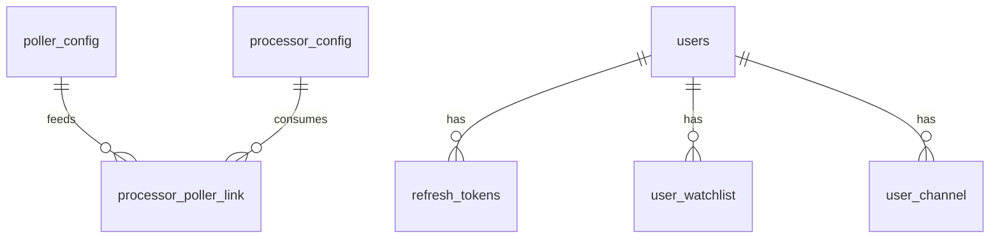

# Data model

MarkAnn's durable state is in PostgreSQL (SQLAlchemy 2 async models in `database/models.py`); its transient/operational state is in Redis. This page is the reference for both.

## PostgreSQL tables

### Identity & auth

**`users`** — accounts and roles.

| Column | Type | Notes |
|---|---|---|
| `id` | int PK | |
| `email` | str, unique | login identity |
| `password_hash` | str | bcrypt |
| `role` | str | `trader` · `admin` · `superuser` (default `trader`) |
| `is_active` | bool | |
| `first_name`, `last_name` | str | |
| `created_by` | int FK → users.id | who created this account |
| `created_at` | datetime | |

A partial unique index enforces **at most one `superuser`**.

**`refresh_tokens`** — server-side refresh tokens, rotated on use (backs the [auth flow](../architecture/security.md#tokens-cookies)).

### Domain

**`user_watchlist`** — which users watch which symbols.

**`user_channel`** — a user's delivery channels (e.g. Telegram).

**`announcements`** — processed corporate announcements. Keyed by `seq_id`; stores `symbol`, `company`, `category`, `announcement_text`, `summary`, `processing_mode` (`multimodal` / `text`), `attachment_url`, `announced_at`. Written by the [corp_ann processor](../architecture/data-flow.md#the-corporate-announcements-pipeline).

**`engine_config`** — engine-level key/value settings.

### Component registry

The tables that make components data. See [Component Registry](../architecture/registry.md).

**`poller_config`**

| Column | Type | Notes |
|---|---|---|
| `id` | int PK | |
| `module` | str, unique | import path, e.g. `engine.pollers.corp_ann` |
| `api_name` | str, unique | stable identifier, e.g. `corp_ann` |
| `output_schema` | text (JSON) | JSON Schema of emitted items |
| `config` | text (JSON) | merged defaults + overrides |
| `enabled` | bool | loaded only if `true` |
| `created_at`, `updated_at` | datetime | |

**`processor_config`** — same shape, with `input_schema` instead of `output_schema`.

**`processor_poller_link`** — many-to-many (`processor_id`, `poller_id`) composite PK linking processors to their source poller(s).



## Redis keys

Full map with types and TTLs in [Data Flow & Redis](../architecture/data-flow.md#redis-key-map). Summary:

| Family | Keys | Role |
|---|---|---|
| Queue & dedup | `queue:{api}`, `inflight:{api}:{item_id}`, `dedup:{api}:{seq_id}` | work distribution + two-level dedup |
| Results & delivery | `result:{date}:{symbol}:{seq_id}`, `alerts:{symbol}` (pub/sub), `watch:{symbol}`, `user:{id}:channels` | processed payloads + live alerts |
| Poller health | `poller:{api}:heartbeat` / `:last_success` / `:status` / `:error_count` / `:interval` | liveness + state |
| Processor health | `processor:{api}:status` | state |
| Events & control | `engine:events` (list), `engine:control` (pub/sub) | log + commands |

## Migrations

Schema changes are Alembic migrations in `database/migrations/versions/`. Alembic requires a **single linear head**.

```bash
# create
alembic -c database/migrations/alembic.ini revision --autogenerate -m "description"
# apply
alembic -c database/migrations/alembic.ini upgrade head
# check heads (should be exactly one)
alembic -c database/migrations/alembic.ini heads
```

In Compose, the one-shot `migrate` service runs `upgrade head` before anything else starts. See [Local Development](../guides/local-development.md#migrations) for the branch/merge caveat.
